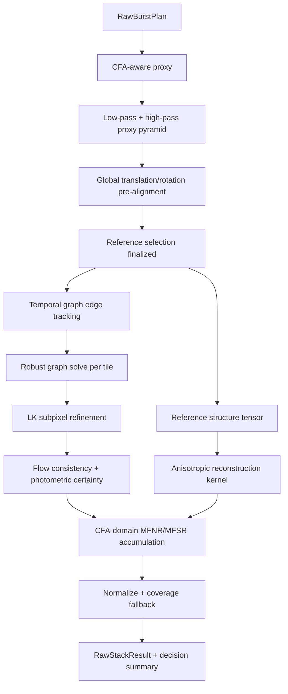

# GlesRawStacker 重构方案：ImageStackAlignator 移动端等价实现

## 1. 方案目标

本方案重构 Photon 的 RAW 多帧拍摄与合成链路，算法目标以 ImageStackAlignator 对 Google HWMF/MFSR 的实现为基准，同时满足 Android Camera2、GLES 3.1、移动端显存、功耗和拍摄延迟约束。

目标不是继续在现有 `GlesRawStacker` 上叠加阈值，而是重新闭合以下逻辑链：

1. 拍摄端为每帧建立可靠的 Camera2 与 Gyro 时间同步元数据。
2. 在进入 GPU 合成前完成帧质量筛选、参考帧选择和处理顺序规划。
3. 使用全局预对齐扩大局部搜索的收敛范围。
4. 使用局部多尺度 patch tracking 生成位移场。
5. 使用有限时间图和鲁棒最小二乘约束多帧位移的一致性。
6. 使用 Lucas–Kanade 完成亚像素精修。
7. 使用噪声模型、光度残差和 flow 不连续度生成可解释的 certainty mask。
8. 使用参考帧结构张量生成各向异性重建核。
9. 在 RAW/CFA 域完成 MFNR 或 MFSR 重建，不从绿色通道推导红蓝细节。
10. 只输出生产决策必需的质量和降级原因，后续 RAW renderer 依据有效融合结果决定去噪强度。

## 2. 基本原则

### 2.1 复刻算法语义，不复刻桌面实现代价

ImageStackAlignator 的优秀设计应尽可能保留其算法语义：

- 全局平移和旋转预对齐。
- 根据整组位移选择几何中心参考帧。
- 多尺度归一化相关 patch tracking。
- 不只测量 `frame -> reference`，还利用帧间依赖和闭环一致性。
- 对异常位移观测进行剔除后重新求解。
- Lucas–Kanade 亚像素精修。
- 参考帧全分辨率结构张量与各向异性重建核。
- 噪声模型驱动的 robustness/certainty。
- RAW 样本直接参与每个 CFA 通道的重建。

以下桌面实现方式不直接复制：

- 所有帧对的 `O(N²)` FFT tracking。
- 全分辨率、多帧 GPU 常驻。
- 暴力扫描大范围旋转角。
- 每个 patch 分配独立 FFT 工作区。
- C# 端大量 GPU/CPU 往返和人工调参流程。

### 2.2 Gyro 负责质量和初值，视觉配准负责最终几何

Gyro 不直接替代图像对齐。其职责限定为：

- 曝光期间运动模糊风险评分。
- 粗略全局旋转和平移搜索中心估计。
- 帧筛除和参考帧质量评分。
- 视觉配准失败时的诊断证据。

最终 RAW 采样坐标必须来自视觉配准得到的局部位移场。原因是 Gyro 无法覆盖 OIS 位移、平移、景深视差、主体运动、rolling shutter 和 Camera/IMU 外参误差。

### 2.3 画质决策必须可解释，但不为诊断增加生产算法

每个帧、tile 和输出像素的拒绝必须能够归因于以下明确证据：

- Gyro 模糊风险。
- focus distance 不一致。
- patch 相关峰不明确。
- 时间图闭环残差过大。
- LK 结构矩阵退化。
- flow 局部不连续。
- 光度残差超过噪声模型可解释范围。
- 高光或暗部没有有效样本。

不再用层层叠加、互相补偿的经验 gate 掩盖上游错误。

可解释性不等于保留一套重型诊断流水线。生产路径遵循：

- 只记录算法本来就会计算的 score、weight、residual 和 reject reason。
- 不为统计额外执行全图 compute pass。
- 不为日志额外拟合第二套 global/affine 模型。
- 不在生产路径 readback flow、certainty、accumulator 或直方图全图。
- 不使用 `glFinish` 获取精确计时。
- Debug 构建可按需启用单次 map 导出，但相关 program、SSBO 和纹理不在默认路径创建。

## 3. 目标数据模型

### 3.1 `RawBurstFrame`

替换当前只包含 image、exposure product 和 focus distance 的 `RawStackFrame`：

```kotlin
data class RawBurstFrame(
    val image: SafeImage,
    val sensorTimestampNs: Long,
    val frameNumber: Long,
    val exposureTimeNs: Long,
    val sensitivityIso: Int,
    val exposureProduct: Double,
    val focusDistanceDiopters: Float,
    val lensState: Int?,
    val rollingShutterSkewNs: Long?,
    val gyroWindow: GyroExposureWindow?,
    val role: RawBurstFrameRole,
)
```

`RawBurstFrameRole` 至少包含：

- `NORMAL`
- `HDR_SHORT`
- `HDR_LONG`

帧对象必须按 `sensorTimestampNs` 排序，但参考帧选择与 GPU 处理顺序由后续 plan 决定，不能再把时间排序后的第一帧隐式当作 reference。

### 3.2 `GyroExposureWindow`

```kotlin
data class GyroExposureWindow(
    val startTimestampNs: Long,
    val endTimestampNs: Long,
    val sampleCount: Int,
    val integratedRotationRad: FloatArray,
    val angularEnergy: Float,
    val peakAngularVelocity: Float,
    val jerkEnergy: Float,
    val coverageRatio: Float,
)
```

### 3.3 `RawBurstPlan`

```kotlin
data class RawBurstPlan(
    val acceptedFrames: List<RawBurstFrame>,
    val rejectedFrames: List<RawFrameRejection>,
    val referenceFrameIndex: Int,
    val processingOrder: IntArray,
    val temporalGraph: RawTemporalGraph,
    val mode: RawStackMode,
    val performanceTier: RawStackPerformanceTier,
)
```

`RawBurstPlan` 是拍摄与算法之间的唯一边界。`GlesRawStacker` 不再自行假设第一帧、帧顺序、角色或可用帧数。

## 4. 拍摄端：Gyro 采集、筛帧和排序

### 4.1 时间同步

新增 `BurstGyroRecorder`，使用 `TYPE_GYROSCOPE_UNCALIBRATED` 优先、`TYPE_GYROSCOPE` 回退，并以传感器支持的最高稳定频率记录环形缓冲。

要求：

1. 使用 `SensorEvent.timestamp`。
2. 每帧使用 `CaptureResult.SENSOR_TIMESTAMP` 和 `SENSOR_EXPOSURE_TIME` 定义曝光窗口。
3. 曝光窗口为 `[sensorTimestamp, sensorTimestamp + exposureTime]`；设备验证必须确认其 timestamp 语义，若设备报告曝光结束时间，则通过日志校准后调整。
4. 为窗口前后保留约 2 ms guard samples，插值到窗口边界。
5. 记录覆盖率；覆盖率不足不能循环复用其他帧 Gyro 数据。
6. Camera2 timestamp 和 Sensor timestamp 的时间基准必须通过设备启动时与实拍日志验证；发现稳定偏移时只允许设备级校准，不允许逐帧猜测。

### 4.2 Gyro 模糊风险评分

参考 eszdmanPhoton 的 `shakiness` 思路，但避免只使用单一积分平方：

```text
gyroBlurScore =
    w1 * projectedIntegratedRotationPx
  + w2 * projectedAngularEnergyPx
  + w3 * projectedPeakVelocityPx
  + w4 * jerkPenalty
  + w5 * coveragePenalty
```

角运动通过当前焦距、sensor active array 和视场角投影到像素域。没有可靠内参时使用归一化角运动，不伪造像素值。

Gyro 评分只反映相机运动，不反映主体运动和纯平移，因此不能作为唯一帧质量指标。

### 4.3 低成本图像质量评分

ImageReader 收齐帧后，在 GPU 主合成前为每张 RAW 生成小尺寸绿色代理图。参考帧规划使用最大长边 128 的直接抽样代理；后续局部 tracking 可独立生成更高分辨率 proxy：

- CFA-aware 绿色采样。
- 黑白电平归一化。
- 曝光归一化。
- 计算 Laplacian/Tenengrad 清晰度。
- 计算高光饱和率、暗部无信息率和坏点异常率。

```text
frameQuality =
    sharpnessReward
  - gyroBlurPenalty
  - saturationPenalty
  - shadowFailurePenalty
  - focusMismatchPenalty
```

### 4.4 初始筛帧规则

筛帧按曝光角色分别执行：

- 非 HDR：至少保留 3 帧；只有 2 帧可用时允许 MFNR，但禁用 MFSR。
- HDR：至少保留 1 张短曝和 2 张 normal；短曝不可因与 normal 曝光不同而被质量比较直接淘汰。
- Gyro 数据缺失只降低置信度，不能自动删除唯一有效曝光角色。
- focus distance 超阈值变化直接拒绝，除非该帧是唯一 HDR 短曝，此时保留但只允许参与受限高光恢复。
- 清晰度显著低于中位数且 Gyro 同时异常的帧拒绝。
- 单一指标异常时保守降权，两个独立指标同时异常才整帧拒绝。

### 4.5 参考帧选择

参考帧不在拍摄端立即固定。流程为：

1. 从质量排名前若干帧中选择候选。
2. 对候选执行低分辨率全局预对齐。
3. 为候选计算：

```text
referenceCost =
    sum(globalTranslationDistanceToAllFrames)
  + maxTranslationPenalty
  + rotationPenalty
  + gyroBlurPenalty
  + sharpnessPenalty
  + edgeCropLossPenalty
  + exposureRolePenalty
```

4. 选择 cost 最低的 normal 帧作为 reference。

这同时吸收 ImageStackAlignator 的几何中心参考帧和 eszdmanPhoton 的稳定帧优先策略。

### 4.6 处理顺序

融合顺序以参考帧为中心向时间两侧扩展，并优先处理：

- 与 reference 全局位移较小的帧。
- Gyro 风险较低的帧。
- 时间图中能为后续帧提供稳定相邻边的帧。

Accumulator 使用加权和，因此处理顺序原则上不应改变最终数学结果；顺序仅用于尽早获得稳定的图约束和在 GPU 超时/热降级时保留最佳子集。

## 5. GlesRawStacker 目标流水线



## 6. Proxy 与预滤波

### 6.1 Proxy 格式

统一使用半分辨率或四分之一分辨率 `R16F` 绿色亮度代理，不再用 RGBA 纹理保存单通道数据。

每个 proxy 像素来自一个 CFA block：

- Bayer：两颗绿色平均。
- Quad Bayer / 特殊 CFA：按实际 CFA 周期生成绿色或亮度代理。
- 先减黑电平、除有效白电平，再应用曝光尺度。

为避免不同曝光和高光截断破坏相关性，proxy 使用单调压缩：

```text
proxy = log(1 + k * linearSignal) / log(1 + k)
```

不得在 RAW 主合成数据上应用该压缩。

### 6.2 双带代理

参考 ImageStackAlignator 的高通经验，同时输出：

- `proxyLow`: Gaussian 低通后用于噪声稳定的 patch matching。
- `proxyBand`: `proxyLow - widerGaussian(proxyLow)`，抑制低频固定图样和渐晕残差。

相关代价同时包含亮度带与高通带：

```text
cost = normalizedL2(proxyLow) + hpWeight * normalizedL2(proxyBand)
```

不在 GLES 中实现通用 FFT 高通；DoG 是移动端等价实现，内存和执行时间可控。

## 7. 全局预对齐

### 7.1 几何模型

全局预对齐只求：

- 平移 `dx, dy`
- 小角度旋转 `theta`

不在此阶段拟合 projective homography。手机 burst 的大透视变化通常意味着场景或拍摄已经不适合稳定 MFSR；过早引入高自由度模型容易吸收局部运动并制造错误几何。

### 7.2 移动端搜索方式

不实现全图 cuFFT。采用 DS16/DS32 proxy 上的 coarse-to-fine compute search：

1. Gyro integrated roll 给出 `theta` 搜索中心。
2. 在小角度集合上评估全局 normalized L2/correlation。
3. 每个角度在低分辨率搜索平移。
4. 保留最优与次优 score，输出 margin 和 coverage。
5. 在更高一层围绕最优解精修。

默认旋转范围由 Gyro 置信度决定；Gyro 缺失时扩大范围，但受严格性能预算限制。

输出：

```kotlin
data class GlobalPreAlignment(
    val dxRawPx: Float,
    val dyRawPx: Float,
    val rotationRad: Float,
    val score: Float,
    val margin: Float,
    val coverage: Float,
)
```

该结果只作为 patch tracking 的初值和参考帧选择依据，不直接成为最终 MFNR/MFSR 主 warp。

## 8. 时间图 Patch Tracking

### 8.1 图结构

ImageStackAlignator 的 `Full` 策略质量高但为 `O(N²)`。移动端采用有界稀疏图：

- reference 到所有 accepted frame 的 anchor edge。
- 时间相邻边 `(i, i+1)`。
- 隔一帧边 `(i, i+2)`，仅在帧数和性能预算允许时启用。
- 对 anchor edge 质量差的帧，增加到最近高质量帧的 recovery edge。

8 帧典型边数约 18～22，而全图为 28。12 帧典型边数约 30～34，而全图为 66。

### 8.2 多尺度局部匹配

每条边执行粗到细 patch tracking：

1. 全局预对齐提供初值。
2. 低层使用较大 tile 和搜索半径。
3. 上采样 flow 到高层。
4. 高层使用较小搜索范围修正。
5. 所有层使用 normalized L2/correlation，不混用语义不一致的代价。
6. 保存 best score、second-best score、coverage 和局部结构强度。

无纹理 tile 不生成“看似有效”的零 flow，而是输出：

- `increment = 0`
- `measurementValid = false`
- 继承上层或全局初值

### 8.3 图一致性求解

对于每个 tile，测量边满足：

```text
observedShift(i -> j) ~= position[j] - position[i]
```

以 reference position 为零，求所有帧的 tile position：

```text
min Σ edgeWeight * robustLoss(
    position[j] - position[i] - observedShift[i,j]
)
```

实现约束：

- 帧数通常不超过 12，方程规模很小。
- GPU 只负责生成 edge observation。
- 将低分辨率 tile observation 成批 readback 到 CPU。
- CPU 使用预计算图矩阵和 2～3 次 IRLS 解 X/Y 两个小型系统。
- Huber/Tukey 权重剔除闭环残差异常边。
- 解算结果上传为每帧 flow seed texture。

CPU 求解避免在 GLES 中实现复杂稀疏线性代数，readback 数据量仅为 tile 数 × edge 数 × 少量 float，远小于 RAW readback。

### 8.4 为什么替换当前 registration gate

当前实现对单帧 flow 再拟合 global translation/affine，并叠加大量 confidence、seed、consistency 和 SR gate。该结构存在两个问题：

1. 先把局部运动压缩为全局模型，再允许有限 local residual，可能损失真实的局部视差与 rolling-shutter 形变。
2. 多个 gate 对同一批证据重复判断，难以确认画质问题来自 flow、模型选择还是阈值组合。

改造后：

- global transform 只作预对齐种子。
- 图优化后的局部 flow 是最终 RAW 采样主几何。
- 整帧拒绝直接使用图求解已经产生的有效边比例和残差，不额外拟合 registration summary。
- MFSR 不再依赖单一 affine transform 生成所有亚像素采样坐标。

## 9. Lucas–Kanade 亚像素精修

图求解得到每帧每 tile 的一致 flow 后，在 reference/current proxy 上执行 LK：

- 使用图 flow 作为初值。
- 2～3 次 inverse compositional LK。
- 计算结构矩阵最小特征值或 determinant。
- 单次增量设物理上限；超限意味着初值或局部模型失败，不允许强行截断后继续当作高置信结果。
- 低纹理区域保留图 flow，LK confidence 置低。
- 输出 refined flow、LK confidence 和 residual。

现有 `flowSmoothPasses` 改为 edge-aware consistency filter：

- 只用邻近高置信 flow 修复无效 tile。
- 不对有效 motion boundary 做普通均值平滑。
- flow discontinuity 保留给 certainty mask 判定遮挡边界。

## 10. Certainty / Robustness 模型

重写现有 `computeRobustness` 与 `computeTileMask`，合并为一套证据明确的 certainty pipeline。

### 10.1 Tile registration confidence

```text
registrationConfidence =
    peakMarginConfidence
  * coverageConfidence
  * graphResidualConfidence
  * lkConditionConfidence
  * lkResidualConfidence
```

### 10.2 像素光度 confidence

对齐后比较 reference 与 current 的同 CFA/代理亮度邻域：

```text
sigmaDiff² = variance(reference) + exposureScale² * variance(current)
photometricConfidence = exp(
    -robustDistance² / (k * sigmaDiff²)
)
```

噪声模型使用现有 per-channel `RawNoiseModel`，并保留 lens-shading gain 对 shot/read noise 的影响。

### 10.3 Flow discontinuity 与遮挡

计算局部 flow 最大最小范围、相邻 divergence 和 forward/backward consistency。高不连续区域：

- certainty 降低或清零。
- 对 mask 做与结构方向相关的 1～2 像素扩张。
- 禁止普通大半径 erosion 吞掉细小静态纹理。

### 10.4 最终权重

```text
certainty =
    frameQualityWeight
  * registrationConfidence
  * photometricConfidence
  * occlusionConfidence
  * clippingConfidence
```

不保留固定 `nonReferenceFrameWeight = 0.92`。非参考帧权重必须由真实质量和传感器 precision 决定。

## 11. 结构张量与重建核

保留当前 `computeStructureTensor` 的总体方向，但按 ImageStackAlignator 语义整理：

1. 只从最终 reference 生成结构张量。
2. 使用轻微低通后的全分辨率或半分辨率亮度梯度。
3. Gaussian 平滑 `Ix²`、`IxIy`、`Iy²`。
4. 使用特征值、coherence 和主方向生成椭圆 Gaussian kernel。
5. 平坦区域扩大核；边缘沿切线伸长、法线收缩；角点/点细节收缩核。
6. 噪声水平只控制核宽度范围，不改变边缘方向。

结构核参数减少为可解释集合：

- `gradientSigma`
- `tensorSigma`
- `detailThresholdLow/High`
- `kernelSigmaFlat`
- `kernelSigmaEdgeTangent`
- `kernelSigmaEdgeNormal`
- `kernelSigmaPoint`

移除当前大量互相重叠的 structure、detail 和 denoise 补偿参数。

## 12. RAW MFNR 重建

### 12.1 采样模型

每个输出 Bayer 像素：

1. 通过最终局部 flow 映射到当前帧 source coordinate。
2. 在相同 CFA 通道样本中搜索 5×5 reconstruction footprint。
3. 使用结构张量核计算空间权重。
4. 使用 certainty、noise precision、曝光和 clipping 权重累计。
5. 分别累计 `sum`、`weight`、`squareSum`、`nonReferenceWeight`。

```text
w = kernelWeight
  * certainty
  * inverseNoiseVariance
  * exposureValidity
  * cfaPhaseValidity
```

Reference 也通过同一重建核进入 accumulator，但 certainty 固定为 1。这样平坦区域可以利用 reference 邻域降噪，边缘区域由结构核保护，而不是把 reference 作为一个特殊的硬回退层。

### 12.2 Accumulator 内存

当前 ping-pong 全尺寸 `RGBA16F` accumulator 占用过高。因为每个 compute invocation 只读写唯一输出像素，可改为单 accumulator texture：

- 每帧 dispatch 前后插入 image memory barrier。
- 同一个 dispatch 内不跨像素读写 accumulator。
- MFNR 使用两张原位更新的 `R32UI`，以 `packHalf2x16` 分别保存
  `value/weight` 与 `squareSum/clipMass`，不再分配 scratch ping-pong。
- 不使用 `RGBA16F` read/write image；PMA110 驱动只接受该格式的 write-only image。
- square sum 精度不足的设备改用可选 `R32F` 辅助纹理，不默认双倍全尺寸 ping-pong。

### 12.3 Normalize

输出优先取 `sum / weight`。只有 weight 不足时才按 certainty 缓慢过渡到 reference reconstruction，禁止硬切 reference。

移除当前 normalize pass 中默认启用的大范围同 CFA 5×5 最终平滑。重建核和多帧 precision accumulation 已经承担主要降噪；额外 post smooth 容易制造塑料纹理并掩盖上游错误。

允许保留一个受严格约束的 residual Wiener：

- 仅在有效帧权重不足且局部结构为平坦区域时工作。
- 强度由实际 temporal variance 与 noise model 偏差驱动。
- 默认最大混合量显著低于当前 `maxSmoothStrength`。
- Debug 构建可抽样记录其使用量；生产路径不为此增加统计 pass。

## 13. RAW MFSR 重建

### 13.1 移除 green-only SR

当前 MFSR 主要重建绿色 lattice，再使用 channel ratio 推导红蓝通道。这会把 demosaic/颜色相关假设带入 RAW super-resolution，并可能产生：

- 红蓝细节缺失。
- 彩色边缘错位。
- 高频区域通道比例泄漏。
- 输出 DNG 的 CFA 语义不纯。

重构后必须对 R、G1、G2、B 的真实 RAW 样本分别重建：

- 每个输出 CFA phase 只收集输入中相同物理颜色/相位的样本。
- 两个绿色可以共享噪声模型，但保留几何采样位置。
- 不再生成 `superResolutionChannelRatioTexture`。
- 不再用 base RGB/channel ratio 补造高分辨率红蓝细节。

### 13.2 Gather 重建

使用 gather 而非原子 splat：

1. 每个高分辨率输出 Bayer 像素映射到 reference raw coordinate。
2. 对每帧使用局部 flow 得到 source coordinate。
3. 枚举相同 CFA phase 的邻近真实样本。
4. 依据亚像素距离、结构核、certainty 和 noise precision 累加。

MFSR accumulator 只保留 normalize 真正消费的 `weightedValue` 与 `weight`，使用
`R32UI + packHalf2x16` 原位更新。Reference 仍经过同一 CFA gather 核，但写入固定单位权重；
因此 `weight - 1` 精确表示非 reference detail support，不需要额外 coverage 通道或第二张
accumulator。二阶矩继续由 native-resolution MFNR accumulator 负责，不在 2x lattice 重复保存。

### 13.3 Coverage 与降级

保留 MFSR 输出决策必需的 coverage，并重新定义为每个 CFA 通道的真实采样覆盖：

- `effectiveWeight`
- `independentFrameCount`
- `subpixelPhaseSpread`
- `registrationConfidence`

不使用单一 phase-bin 数量决定整帧参与与否。phase novelty 进入连续权重，不做过早 hard gate。

输出降级：

- 高 coverage：使用 MFSR reconstruction。
- 中 coverage：MFSR 与结构核控制的 native reconstruction 混合。
- 低 coverage/运动区域：回退 reference/MFNR 的 CFA-aware upscale。

### 13.4 输出倍率

- 内部 lattice 使用 2x，保持亚像素定义清晰。
- 用户 1.5x 输出在重建后按 CFA-aware resize 或 DNG/renderer 约定处理。
- 2x 仅在原始分辨率、显存和 GPU tier 满足时启用。
- 大像素 RAW 必须采用 output tiling，不能分配完整 2x accumulator。

当前实现使用 256 行 output stripe 和 accepted-frame 压缩缓存：每个参与 MFSR 的帧缓存
`RGBA16F flow + R8 robustness + R16F tile mask`，不缓存完整 RAW GPU texture。重建每个 stripe
时根据最终 flow 的 Y 极值、输出倍率、CFA period 和 filter margin 计算 source row band，直接从
仍持有的 Camera2 RAW plane buffer 上传该行段。所有 stripe 合计约上传一遍 RAW 加少量 halo，
不会为每个 stripe 重传整帧，也不会重跑对齐。

MFSR accumulator 固定为 `outputWidth × min(outputHeight, 256)` 的单张 `R32UI`，完成一个 stripe
后立即 normalize 到最终 `RG8` 输出 texture。全尺寸 1.5x/2x accumulator 已不再分配。

## 14. HDR 处理边界

HDR 的 normal 合成与短帧配准按 `1.23.1` 回退，并通过当前 packed accumulator 格式做等价适配；
高光覆盖与色度恢复按实际采样足迹闭合：

1. 第一张 normal 是原生输出参考，其余 normal 使用局部 flow 对齐后累加。
2. 短帧使用曝光归一化 proxy 和旧版整数全局平移搜索，不参与 normal accumulator。
3. normal accumulator 除 clipping alpha 外，独立记录每个目标像素的 highlight influence；该 influence
   来自 3×3 重建核与双线性采样合并后的完整 4×4 同相位采样足迹，而不是只检查中心采样点。
4. 初始 recovery mask 对 2×2 block 的四个 CFA 相位分别检查 reference 饱和风险与 accumulator
   influence；任一相位受影响即要求色度恢复，四相位全部受影响才归为完全覆盖。
5. 初始 mask 再按 HDR same-CFA 后滤波的真实 block 半径执行一次硬覆盖扩展；扩展 block 归为部分影响，
   不执行 feather 或连续权重混合。
6. normal 的 LSC 校正值在映射到短帧输出曝光域之前不得 clamp；必须先乘目标曝光尺度，最后统一截断，
   避免未到 sensor white level 的相位提前丢失高光比例。
7. 高光可靠上限固定保留 10% sensor headroom；任一相位达到 0.90 即切换到短帧色度来源。
8. 每个 HDR 2×2 block 都强制满足共同亮度倍率的色度后置条件：安全 block 使用 normal reference
   四相位比例，受影响 block 使用短帧四相位比例。公共倍率来自 normal accumulator，短帧只负责色度来源。
9. DNG `BaselineExposure` 和 PGTM 路径保持当前工程接口。

## 15. 应删除或替换的当前逻辑

### 15.1 删除

- 固定 `frames.first()` 为 reference。
- 固定非参考帧权重。
- 以 single global/affine registration transform 作为 RAW 主 warp。
- 对 global transform 叠加被强行截断的 local residual 作为主要几何。
- green-only MFSR accumulator。
- `superResolutionChannelRatioTexture` 及其红蓝通道比例重建。
- 默认强 final same-CFA smooth。
- Gyro 数据不足时循环复用其他帧数据的任何方案。
- 配准失败后以 identity 当作正常成功帧参与融合。
- 仅用于统计的 `diagnosticAlignmentProgram`、`diagnosticFinalProgram`、全图 diagnostic SSBO 和对应 readback。
- 仅用于 compact log、但重复执行 registration/global estimation 的路径。
- 生产构建中的 flow/robustness/tile-mask 分布直方图和 debug-map 输出。

### 15.2 替换

- `computeRobustness + computeTileMask` 替换为统一 certainty pipeline。
- registration 多层 gate 替换为 patch peak、graph residual、LK condition 和 photometric residual 的证据链。
- 普通 flow averaging 替换为 edge-aware invalid-flow repair。
- 单帧 `frame -> reference` 配准替换为稀疏时间图约束。
- HDR short 独立 global-only 对齐替换为共享 global/local tracking。

### 15.3 保留

- Camera2 per-channel noise model。
- lens shading 对噪声与 precision 的影响。
- CFA-aware RAW normalization。
- GPU 分行 dispatch 与 UI renderer 调度让步。
- GL/内存完整释放和失败路径。
- 算法内生的轻量 decision summary；不保留独立 diagnostics GPU 流水线。
- MFSR coverage fallback，改为连续、逐通道证据。
- PGTM/DNG 输出语义，适配新的 stack metadata。

## 16. 移动端性能与内存设计

### 16.1 不让所有 RAW 帧常驻 GPU

仅保留：

- reference RAW texture。
- current RAW texture。
- reference/current proxy pyramid。
- 当前 edge 的 flow/certainty 工作纹理。
- 每帧最终 flow seed/压缩 flow，按需上传或存 CPU。
- accumulator 和输出 tile。

所有非 reference 帧按流式顺序 upload、处理、释放。

### 16.2 纹理格式

建议：

| 数据 | 格式 |
| --- | --- |
| RAW input | `R16UI` |
| proxy | `R16F` |
| proxy pyramid | `R16F` |
| tile flow | `RG16F`，超大位移设备使用 `RG32F` |
| confidence/certainty | `R16F` |
| structure kernel | `RGBA16F` 或两个 `RG16F` |
| MFNR accumulator | 两张原位 `R32UI`，四个 half 保存完整统计量 |
| MFSR accumulator | 单张原位 `R32UI`，两个 half 保存 value/weight |
| global score | SSBO，小规模 |
| graph observations | SSBO/readback，小规模 |

### 16.3 输出分块

MFNR 在高分辨率设备、MFSR 在所有设备上支持 output tile：

- tile 推荐 512～1024 输出像素。
- halo 至少覆盖最大 structure kernel、flow interpolation 和 CFA period。
- 每个 tile 流式遍历 accepted frames。
- tile 完成后直接写入最终 direct buffer。
- tile 边界使用相同 reference coordinate，重叠区只保留中心有效区域，不做后期拼接补偿。

这使 MFSR accumulator 内存由整张 2x 图降低为一个 output tile。

### 16.4 性能档位

`RawStackPerformanceTier` 根据像素数、帧数、`ActivityManager.memoryClass`、GL 限制和基准测试选择：

| 档位 | 典型策略 |
| --- | --- |
| HIGH | reference+adjacent+skip temporal graph，3 层 tracking，LK 3 次，允许 2x tiled MFSR |
| MEDIUM | reference+adjacent graph，3 层 tracking，LK 2 次，1.5x tiled MFSR |
| LOW | reference+adjacent graph，2 层 tracking，LK 1～2 次，只允许 MFNR |

降级必须减少计算规模，不能改变正确性定义：

- 减少 temporal graph 边。
- 减少 pyramid 层和 LK 次数。
- 降低 SR 输出倍率或关闭 SR。
- 减少 accepted frame 数，但保留最高质量和时间覆盖。

禁止通过放宽配准/ghost 阈值换取速度。

### 16.5 热与时延预算

建议目标，以 12 MP、6～8 帧为基准：

- 帧质量 proxy：100 ms 内。
- 全局预对齐与 reference selection：150 ms 内。
- 时间图 patch tracking：400 ms 内。
- graph solve + LK：250 ms 内。
- MFNR accumulate + normalize：700 ms 内。
- 总 GPU stack：1.5～2.0 s 级，具体以设备 tier 校准。

每个长 compute pass 继续使用 row/tile dispatch 和 fence checkpoint，避免 GPU watchdog、UI 卡死和长时间独占。

### 16.6 生产可观测性预算

生产路径只保留以下标量，且全部复用算法中已经存在的数据：

- accepted/rejected frame count 与逐帧 reject reason。
- 参考帧索引和 reference cost。
- temporal graph 有效边数、拒绝边数和最大 IRLS residual。
- 每帧有效 tile 比例；在 graph observation CPU 数组上顺便累计。
- MFNR/MFSR 最终有效权重是否达到输出门槛。
- MFSR 是否降级及单一 fallback reason。
- 每个主要 stage 的 CPU wall time；GPU 时间只在已有 fence 边界近似计算。
- GL error、allocation failure 和性能 tier。

生产路径删除：

- GPU 原子直方图。
- 全图 percentile 统计。
- 为统计创建的 accumulator/flow/certainty 镜像纹理。
- 为诊断增加的 shader dispatch。
- 常态化 PBO/SSBO 全图 readback。
- 每帧输出 matrix、flow sample 或长 compact summary。

Debug 构建通过单一 `RawStackDebugCapture` 开关支持一次只抓取一种中间图。抓取时明确接受性能下降，不允许该代码改变生产 pass 顺序、uniform 或资源生命周期。

## 17. 文件与模块改造

### 17.1 新增

- `camera/BurstGyroRecorder.kt`
- `camera/GyroExposureWindow.kt`
- `processor/RawBurstFrame.kt`
- `processor/RawBurstPlanner.kt`
- `processor/RawFrameQualityAnalyzer.kt`
- `processor/RawGlobalPreAligner.kt`
- `processor/RawTemporalGraph.kt`
- `processor/RawTemporalGraphSolver.kt`
- `processor/RawStackPerformanceTier.kt`
- `processor/RawStackCertaintyModel.kt`

### 17.2 重构

- `Camera2Controller.kt`
  - burst 开始前启动 Gyro ring buffer。
  - 保存每帧完整 CaptureResult 元数据。
  - burst 完成后闭合每帧曝光窗口。
- `CameraViewModel.kt`
  - 不再只维护两个平行 ArrayList。
  - 组装 `RawBurstFrame`，调用 `RawBurstPlanner`。
- `MultiFrameStacker.kt`
  - 接收 `RawBurstPlan`。
  - 删除重新猜测 exposure/focus fallback 的逻辑。
- `GlesRawStacker.kt`
  - 拆分 orchestration 与 shader source。
  - 接收显式 reference、temporal graph 和 performance tier。
  - 按本方案重建 pass。
- `RawStackTuningProfile.kt`
  - 删除为补偿当前 gate 形成的重叠参数。
  - 参数按 proxy、global、patch、graph、LK、certainty、kernel、reconstruction 分组。
- `RawStackDiagnostics.kt`
  - 缩减为 `RawStackDecisionSummary`，只保存处理过程中已产生的标量结果和拒绝原因。

### 17.3 Shader 拆文件

当前 `GlesRawStacker.kt` 同时包含 Kotlin orchestration 和数千行 shader 字符串，难以验证 pass 边界。将 shader 移至 assets：

- `assets/shaders/rawstack/proxy.comp`
- `assets/shaders/rawstack/downsample.comp`
- `assets/shaders/rawstack/global_search.comp`
- `assets/shaders/rawstack/patch_match.comp`
- `assets/shaders/rawstack/lk_refine.comp`
- `assets/shaders/rawstack/flow_consistency.comp`
- `assets/shaders/rawstack/certainty.comp`
- `assets/shaders/rawstack/structure_tensor.comp`
- `assets/shaders/rawstack/reconstruction_kernel.comp`
- `assets/shaders/rawstack/mfnr_accumulate.comp`
- `assets/shaders/rawstack/mfsr_accumulate.comp`
- `assets/shaders/rawstack/normalize.comp`

公共 CFA、noise、LSC、warp 函数通过构建时 include/preprocess 组合，不复制多份略有差异的坐标逻辑。

## 18. 实施里程碑

### 里程碑 A：拍摄元数据与 Gyro 闭环

- 完成 `BurstGyroRecorder`。
- `RawBurstFrame` 替换平行 images/results 列表。
- 完成 timestamp、曝光窗口和 coverage 日志。
- 完成 Gyro + RAW 低成本质量评分。
- 暂不改变现有 stack 输出，只记录新 plan。

验收：

- 每帧 Camera2/Gyro 对应关系可追踪。
- 不出现 Gyro 窗口串帧和循环复用。
- 静止、轻抖和明显抖动的评分排序符合实拍。

### 里程碑 B：全局预对齐与参考帧选择

- 实现小尺寸 proxy 和 DoG band。
- 实现平移/旋转 coarse-to-fine search。
- `RawBurstPlanner` 输出 reference 与处理顺序。
- 现有 stack 可先使用新 reference 验证收益。

验收：

- 参考帧不再固定第一张。
- 参考帧选择降低整组最大位移和边缘裁切。
- 明显模糊帧不被选为 reference。

### 里程碑 C：稀疏时间图与一致 flow

- 实现 anchor、adjacent、skip edges。
- patch matcher 输出 score/margin/coverage。
- CPU IRLS graph solver。
- graph residual 驱动 outlier rejection。

验收：

- 闭环位移残差显著小于独立 reference tracking。
- 远离 reference 的帧可通过相邻链路稳定求解。
- 错误 edge 被拒绝而不是污染整帧 flow。

### 里程碑 D：LK 与 certainty 重写

- graph flow seed 进入 LK。
- edge-aware invalid flow repair。
- 合并 robustness/tile mask。
- Debug 构建按需抓取 registration、photometric 或 occlusion certainty；生产构建不生成额外可视化资源。

验收：

- 运动边缘无明显重影。
- 平坦区域不会因无纹理产生随机 flow。
- 整帧/整 tile 拒绝可由算法内生 reason code 定位，不依赖额外诊断 pass。

### 里程碑 E：MFNR 重建核与 accumulator

- 结构张量参数语义整理。
- 局部 flow 成为 RAW 主 warp。
- 单 accumulator 或 tiled accumulator。
- 移除固定 frame weight 和默认强 post smooth。

验收：

- 静态区域达到理论帧数对应的噪声下降趋势。
- 低 ISO 高频纹理不塑料化。
- reference 与非 reference 坐标验证完全一致。

### 里程碑 F：全 CFA MFSR

- 删除 green-only/channel-ratio 路径。
- 对 R/G1/G2/B 分别 gather reconstruction。
- CFA-channel coverage 和连续 fallback。
- tiled 1.5x/2x 输出。

验收：

- 彩色边缘不依赖绿色比例生成。
- 高频彩色测试卡无通道错位和棋盘伪细节。
- 低 coverage 区域平滑回退，无硬边界。

### 里程碑 G：HDR 共用对齐基础设施

- short frame 使用 global/local flow。
- recovery certainty 与主 stack certainty 对齐。
- HDR 失败与 normal MFNR 解耦。

验收：

- 高光边缘无 global-only 对齐造成的局部错位。
- short frame 不污染中暗部。
- PGTM/DNG 语义保持正确。

### 里程碑 H：清理旧逻辑与调参收敛

- 删除废弃 shader、texture、gate 和 tuning 参数。
- 更新轻量 decision summary、metadata 与 renderer denoise policy。
- 完成多设备性能 tier。
- 在删除旧路径前使用固定 RAW burst corpus 做 A/B。

验收：

- 不存在新旧两套 warp/certainty 同时影响输出。
- 代码中的每个 tuning 参数都对应明确公式或物理意义。
- 输出差异优先通过算法内生标量解释；只有离线调试才抓取单项 debug map。

## 19. 验证体系

### 19.1 算法单元测试

- Gyro 窗口切片和积分。
- timestamp 边界插值。
- 参考帧 cost 选择。
- temporal graph 矩阵构建。
- 合成位移数据的 IRLS 求解和异常边剔除。
- CFA phase 映射。
- per-channel noise variance。
- MFSR phase/coverage。

### 19.2 GPU 合成测试

建立固定 RAW burst corpus，至少包含：

- 纯平移。
- 小角度旋转。
- affine/轻微透视。
- rolling-shutter 摆动。
- 前景运动和背景静止。
- 遮挡出现/消失。
- 低纹理墙面。
- 高频织物与文字。
- 单帧人为运动模糊。
- hot pixel/暗场。
- HDR 短曝高光。

为已知几何的合成数据记录：

- global transform error。
- tile flow endpoint error。
- graph loop residual。
- LK residual。
- certainty AUC/错误接受率。
- MFNR temporal noise reduction。
- MFSR slanted-edge MTF 和假频能量。

### 19.3 实拍验收

每台代表设备覆盖：

- ISO 100/400/1600/3200。
- 1/1000、1/100、1/15、1/4 秒。
- OIS 开/关可控时分别测试。
- 静物手持、人物轻动、行走主体、树叶、水面。
- 中心和边角高频纹理。
- 点光源和高反差窗口。
- 4/8/12 帧。

必须与以下输出盲测：

- 最佳单帧。
- 当前 GlesRawStacker。
- 新 MFNR。
- 新 MFSR。

### 19.4 性能指标

- 每个 pass GPU 时间。
- 峰值 Java/native/GPU 内存估算。
- GL allocation failure。
- GPU fence 超时。
- UI frame drop。
- 设备温度与连续三次拍摄时延退化。
- 降级原因和最终 tier。

## 20. 完成定义

重构完成必须同时满足：

1. 拍摄端每帧拥有完整 Camera2 与 Gyro 曝光窗口元数据。
2. Gyro 与图像质量共同参与筛帧，Gyro 不直接替代视觉对齐。
3. Reference 由整组几何与质量 cost 选择，不固定第一张。
4. Global translation/rotation 只作为局部 tracking 初值。
5. 最终 RAW warp 来自时间图约束并经 LK 精修的局部 flow。
6. 稀疏时间图能够检测并剔除错误 patch observation。
7. Certainty 由明确的 registration、noise、photometric 和 occlusion 证据组成。
8. MFNR 使用结构张量重建核，不依赖默认强 post smooth 获得干净观感。
9. MFSR 对全部 CFA 通道使用真实 RAW 样本重建。
10. HDR short frame 复用统一的全局/局部对齐基础设施。
11. 12/24/48 MP 均有明确内存策略和性能降级，不以放宽质量阈值降级。
12. 旧 global-primary warp、green-only SR、channel-ratio SR 和重叠 gate 被删除。
13. 所有质量参数具有明确公式、单位或物理含义。
14. 固定 corpus、单元测试、GPU 测试和真实设备测试全部通过。
15. `./gradlew compileDefaultDebugKotlin` 与 `./gradlew buildCMakeDebug` 通过。

## 21. 推荐实施顺序

严格按以下依赖顺序实施：

```text
帧元数据/Gyro
→ 质量评分
→ 全局预对齐
→ 参考帧选择
→ 时间图 patch tracking
→ graph solve
→ LK
→ certainty
→ MFNR reconstruction
→ MFSR reconstruction
→ HDR
→ 旧路径清理
```

不得先改最终平滑或继续增加融合阈值来补偿 reference、flow 或 certainty 的错误。每个里程碑先用固定 corpus、算法内生标量和按需离线抓图证明上游输出正确，再接入下一阶段。
