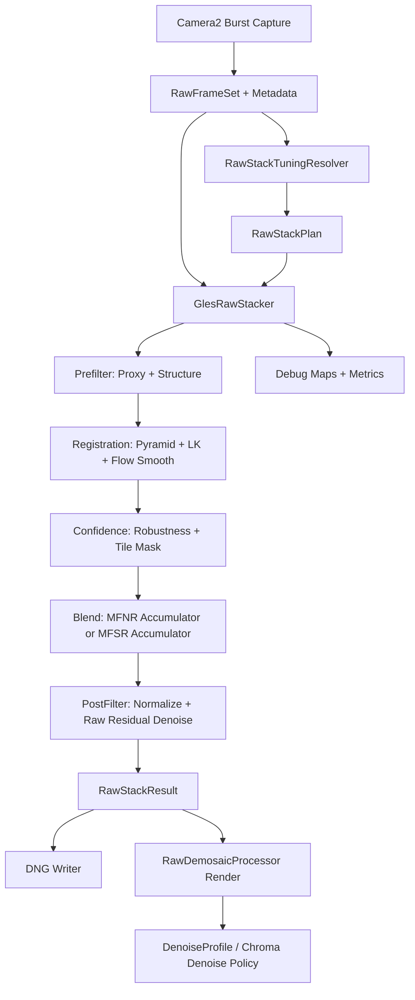

# RAW Stack MFNR/MFSR Implementation Plan

## 背景

Photon 目前已经有一条可工作的 RAW 域多帧栈，主入口是：

- `app/src/main/java/com/hinnka/mycamera/processor/MultiFrameStacker.kt`
- `app/src/main/java/com/hinnka/mycamera/processor/GlesRawStacker.kt`
- `app/src/main/cpp/stacking_utils.cpp`
- `app/src/main/java/com/hinnka/mycamera/raw/RawDemosaicProcessor.kt`
- `app/src/main/java/com/hinnka/mycamera/raw/DenoiseProfileShaders.kt`

当前 GLES RAW stack 已经包含：

- RAW_SENSOR 输入校验与 16-bit fused Bayer 输出。
- reference/current proxy 构建。
- 金字塔对齐、tile flow、LK refine、flow smooth。
- structure tensor 生成局部各向异性采样核。
- robustness map、tile mask、RAW 域同 CFA phase 采样。
- noise model 加权累加。
- HDR short/normal RAW 合成与高光恢复。
- normalize pass 中的同 CFA 邻域 Wiener/post smooth。

因此目标不是接入 Qualcomm 的闭源 MFNR/MFSR，而是把 CamX/CHI 暴露出来的架构、stage 划分、调参维度、触发条件、诊断思路转化为 Photon 自己的可调、可验证、可跨设备维护的 RAW stack。

## 目标

1. 将现有 `GlesRawStacker` 整理为完整的 RAW 域 MFNR 引擎。
2. 在 GLES RAW path 中实现 MFSR，避免开启 MFSR 时退回 CPU path。
3. 建立 Photon 自己的 tuning profile 体系，按 ISO、noise model、EV/LV、帧数、HDR/MFNR/MFSR 场景选择参数。
4. 使用 Camera2 可公开获得的 metadata，把 per-channel noise、lens shading、exposure、frame role 纳入融合权重。
5. 将 RAW 栈和后续 demosaic/render denoise 串成闭环，避免重复降噪或互相抵消。
6. 建立可复现实拍校准、debug map、指标统计、测试覆盖和设备验证流程。

## 非目标

1. 不直接复制 CamX/CHI 源码、tuning XML、CSL/Chromatix 数值或 Qualcomm 专有实现。
2. 不尝试在普通第三方 App 中调用 Qualcomm 内部 MFNR/MFSR vendor feature。
3. 不把 CamX tuning 文件打包进 Photon。
4. 不依赖特定 SoC 私有 HAL 行为作为必要条件。
5. 不让 MFSR 只在 CPU path 可用；GLES path 必须有完整实现。

## CamX/CHI 可利用内容

CamX/CHI 里的价值主要是工程结构和参数维度，不是可直接搬运的算法内核。

### 可作为架构参考的文件

- `/Users/zhoubinjia/Projects/CamxChi/chi-cdk/oem/qcom/feature2/chifeature2mfsr/chifeature2hwmultiframe.cpp`
  - 参考多帧 feature 的 stage 划分：prefilter、blend init、blend loop、postfilter、noise reprocess。
  - 参考 frame dependency 和 request flow 的组织方式。
- `/Users/zhoubinjia/Projects/CamxChi/chi-cdk/oem/qcom/feature2/chifeature2graphselector/chifeature2mfnrdescriptor.cpp`
  - 参考 MFNR graph 选择维度。
- `/Users/zhoubinjia/Projects/CamxChi/chi-cdk/oem/qcom/feature2/chifeature2graphselector/chifeature2mfsrdescriptor.cpp`
  - 参考 MFSR graph 选择维度。
- `/Users/zhoubinjia/Projects/CamxChi/chi-cdk/oem/qcom/topology/usecase-components/segments/common/MfnrPrefilter.xml`
  - 参考 prefilter 和 proxy/denoise 前处理的独立 stage 思路。
- `/Users/zhoubinjia/Projects/CamxChi/chi-cdk/oem/qcom/topology/usecase-components/segments/common/MfnrBlend.xml`
  - 参考 blend loop、registration、confidence/weight 的抽象边界。
- `/Users/zhoubinjia/Projects/CamxChi/chi-cdk/oem/qcom/topology/usecase-components/segments/common/MfnrPostFilter.xml`
  - 参考 postfilter 独立于 blend 的设计。
- `/Users/zhoubinjia/Projects/CamxChi/chi-cdk/oem/qcom/topology/usecase-components/segments/common/MfsrPrefilter.xml`
- `/Users/zhoubinjia/Projects/CamxChi/chi-cdk/oem/qcom/topology/usecase-components/segments/common/MfsrBlend.xml`
- `/Users/zhoubinjia/Projects/CamxChi/chi-cdk/oem/qcom/topology/usecase-components/segments/common/MfsrPostFilter.xml`
  - 参考 MFSR 与 MFNR 共享大量 stage，但输出 grid、采样核和后处理不同。
- `/Users/zhoubinjia/Projects/CamxChi/camx/src/hwl/iqsetting/tf20setting.cpp`
- `/Users/zhoubinjia/Projects/CamxChi/camx/src/hwl/iqsetting/anr10setting.cpp`
- `/Users/zhoubinjia/Projects/CamxChi/camx/src/hwl/iqsetting/hnr10setting.cpp`
- `/Users/zhoubinjia/Projects/CamxChi/camx/src/hwl/iqsetting/abf40setting.cpp`
  - 只参考参数类别：temporal filtering、adaptive noise reduction、high-frequency noise reduction、Bayer filter。

### 可转换为 Photon tuning 维度的内容

| CamX/CHI 概念 | Photon 落点 | 说明 |
| --- | --- | --- |
| Feature2.MFNRPrefilter | `buildProxy`、`computeStructureTensor` | 构建稳定对齐 proxy 和局部结构信息。 |
| Feature2.MFNRBlend | `alignCurrentToReference`、`computeRobustness`、`accumulateFrame` | 多帧对齐、ghost reject、加权融合。 |
| Feature2.MFNRPostFilter | `normalizeOutput`、`RawDemosaicProcessor` denoise pass | 融合后残余噪声处理。 |
| Feature2.MFSRPrefilter | proxy/structure + SR grid 准备 | 复用 MFNR prefilter，但需要输出 grid 参数。 |
| Feature2.MFSRBlend | SR accumulator | 将 subpixel shifted sample 投影到高分辨率 Bayer lattice。 |
| Feature2.MFSRPostFilter | SR hole filling、detail restore、post denoise | 保证高分辨率 DNG/渲染可用。 |
| TF | temporal weights、frame confidence | 不是硬件 TF，而是多帧融合权重和 temporal rejection。 |
| ANR/HNR/ABF | raw post smooth、render denoise、chroma denoise | 按不同域拆分，避免过度降噪。 |
| tuning trigger | `RawStackTuningResolver` | 由 ISO、LV、noise、frame count、motion score 触发。 |

### SR registration 证据链与 Photon 落点

CamX/CHI 的 MFSR 对齐不是把 sparse tile flow 直接当最终 SR 采样几何使用，而是把 registration 作为 prefilter/blend 之间的独立产物传递：

- `MfsrPrefilter.xml` 输出 Full/DS4/DS16/DS64 以及 `REG_OUT`，说明 registration image/context 是 prefilter 的明确输出。
- Kona `MfsrPrefilter.xml`/`MfsrBlend.xml` 走 CVP registration，blend 阶段使用 previous context/reference image 和 current target image。
- `camxchinodeswregistration.*` 通过 `libswregistrationalgo` 的 `register_mf(anchor, ref, postproc, gmv[9], confidence)` 输出 3x3 transform 和 confidence。
- `camxcvpnode.cpp` 走 `cvpDme_Async`，核心结果是 `nTransformConfidence`、`CoarseTransform[9]`、`PostICATransform`，并带有 force-identity 逻辑。
- `chifeature2utils.h` 使用固定 registration input resolution map；`chifeature2hwmultiframe.cpp` 在较小尺寸下关闭 DS64。
- `cvp10_ipe.mf_blend.xml` 启用 transform confidence，confidence 低于 100 时强制 identity。

Photon 侧对应落点：

- `RawStackRegistration.kt` 建立 CamX-style registration setup：half-res 输入、固定 registration size map、DS64 gate、3x3 ICA geometry、confidence/identity fallback。
- `RawStackFrameRegistrationEstimator.kt` 从现有 flow/robustness/tile mask 估计全局 affine transform，输出与 CamX 下游形态一致的 matrix + confidence + identity flag。
- `GlesRawStacker.kt` 在 `computeTileMask()` 后读取 registration samples，fit registration transform，并在 `accumulateFrame()` 中使用 registration transform 采样 current RAW；local flow 保留为 robustness/tile confidence 的输入。
- `RawStackDiagnostics.kt` 增加 `reg`、`regConf`、`regIdentity`、`regInlier`、`regResP90Max`，用于判断 MFSR 是否具备进入 SR accumulator 的对齐质量。

后续实现 MFSR 时必须沿用这个边界：SR accumulator 的主几何输入是 registration transform 和 confidence；tile flow 只作为局部可信度、motion rejection、detail restore gate，不能再把未收敛的 sparse flow 直接作为 SR 几何依据。

## 现状问题

1. `GlesRawStacker` 的核心参数大多是 companion object 常量或 shader 内常量。
   - 对齐：`PYRAMID_LEVELS`、`ALIGN_LEVEL`、`SEARCH_RADIUS_LEVEL`、`ALIGN_WINDOW_SIZE`。
   - flow：`LK_REFINE_PASSES`、`FLOW_SMOOTH_PASSES`、`FLOW_OUTLIER_THRESHOLD_PX`。
   - blend：`NON_REFERENCE_FRAME_WEIGHT`。
   - shader 内：noise floor scale、robust tau、tile mask 阈值、final smooth amount、highlight suppression。

2. `SENSOR_NOISE_PROFILE` 当前被平均成全局 `(S, O)`。
   - 这会丢失 R/G/B 通道噪声差异。
   - lens shading correction 后的边角噪声权重也不够准确。

3. RAW stack 调用处当前没有传入真实 lens shading map。
   - `GlesRawStacker` 支持 lens shading texture，但 `GalleryManager.saveRawStackedPhoto` 传的是 null。

4. 开启 RAW MFSR 时 GLES path 不工作。
   - `MultiFrameStacker.processBurstRaw` 当前会记录 `GLES RAW stacker does not support SR; falling back to CPU RAW stacker`。

5. RAW stack denoise 和 render-domain `DenoiseProfileShaders` 之间缺少统一策略。
   - 用户开启 MFNR/MFSR 后，后续 render denoise 应该按 stack confidence/有效帧数自动降强度。

6. 缺少可视化和统计闭环。
   - 现在不容易判断失败来自对齐、ghost rejection、noise model、postfilter 还是 DNG/render。

## 目标架构



## 新增核心模型

### `RawStackMode`

建议新增文件：

- `app/src/main/java/com/hinnka/mycamera/processor/RawStackMode.kt`

枚举：

- `MFNR`
- `MFSR`
- `HDR_MFNR`
- `HDR_MFSR`

用途：

- 替代 scattered boolean：`enableSuperResolution`、`hdrMode`、`useMFNR`、`useMFSR`。
- 让 tuning、日志、debug map、metadata 都能明确知道当前 pipeline。

### `RawNoiseModel`

建议新增文件：

- `app/src/main/java/com/hinnka/mycamera/processor/RawNoiseModel.kt`

字段：

- `channelCount: Int`
- `s: FloatArray`
- `o: FloatArray`
- `normalizedS: FloatArray`
- `normalizedO: FloatArray`
- `referenceSignal: Float`
- `hasValidCamera2Profile: Boolean`

实现要求：

- 保留 Camera2 `SENSOR_NOISE_PROFILE` 的 per-channel pair。
- 统一做 raw value domain 与 normalized domain 的换算。
- 提供 `forCfaIndex(index)`。
- 提供 scalar fallback，兼容现有 shader。
- 单元测试覆盖 1、2、4 channel 输入和空输入。

### `RawStackTuningProfile`

建议新增文件：

- `app/src/main/java/com/hinnka/mycamera/processor/RawStackTuningProfile.kt`

字段建议：

```kotlin
data class RawStackTuningProfile(
    val mode: RawStackMode,
    val frameCountTarget: Int,
    val referenceFramePolicy: ReferenceFramePolicy,
    val align: RawStackAlignTuning,
    val flow: RawStackFlowTuning,
    val structure: RawStackStructureTuning,
    val robustness: RawStackRobustnessTuning,
    val blend: RawStackBlendTuning,
    val postFilter: RawStackPostFilterTuning,
    val hdr: RawStackHdrTuning,
    val superResolution: RawStackSuperResolutionTuning,
    val renderDenoise: RawStackRenderDenoisePolicy,
)
```

子结构建议：

- `RawStackAlignTuning`
  - `pyramidLevels`
  - `alignLevel`
  - `windowSize`
  - `searchRadiusLevel`
  - `sampleStep`
  - `coveragePenalty`
  - `shiftPenalty`
- `RawStackFlowTuning`
  - `lkPasses`
  - `lkWindowRadius`
  - `lkMaxDelta`
  - `smoothPasses`
  - `outlierThresholdPx`
- `RawStackStructureTuning`
  - `kernelDetail`
  - `kernelDenoise`
  - `anisotropyThreshold`
  - `shrink`
  - `stretch`
  - `flatnessSnrLow`
  - `flatnessSnrHigh`
- `RawStackRobustnessTuning`
  - `noiseFloorSpatialScale`
  - `noiseFloorEdgeScale`
  - `residualTauBase`
  - `residualTauEdge`
  - `residualPower`
  - `flowPenaltyStartPx`
  - `flowPenaltyDecay`
  - `flowRangePenaltyStartPx`
  - `flowRangePenaltyDecay`
  - `centerMixFlat`
  - `centerMixEdge`
  - `minMixFlat`
  - `minMixEdge`
- `RawStackBlendTuning`
  - `referenceWeight`
  - `nonReferenceFrameWeight`
  - `minRobustnessFloor`
  - `precisionReferenceSignal`
  - `wienerBaseWeight`
  - `highlightSuppressionStart`
  - `highlightSuppressionEnd`
  - `highlightSuppressionStrength`
- `RawStackPostFilterTuning`
  - `enabled`
  - `flatVarianceStart`
  - `flatVarianceEnd`
  - `smoothStrength`
  - `detailKeepNoiseLow`
  - `detailKeepNoiseHigh`
  - `detailKeepOffsetLow`
  - `detailKeepOffsetHigh`
  - `hdrRecoverySmoothSuppression`
- `RawStackSuperResolutionTuning`
  - `enabled`
  - `internalScale`
  - `outputScale`
  - `splatRadius`
  - `phaseTolerance`
  - `holeFillPasses`
  - `minEffectiveWeight`
  - `detailRestoreStrength`

### `RawStackTuningResolver`

建议新增文件：

- `app/src/main/java/com/hinnka/mycamera/processor/RawStackTuningResolver.kt`

输入：

- mode
- frame count
- ISO
- exposure time
- aperture
- exposure product
- Camera2 noise profile
- light value
- available device memory class 或 image size
- user raw denoise value
- hardware NR level

输出：

- `RawStackTuningProfile`

策略：

- 明亮低 ISO：更强调 detail preserve，降低 final smooth 和 ghost rejection 激进度。
- 高 ISO：提高 non-reference 权重、提高 post smooth、放宽 robustness noise floor。
- 长曝光：提高 hot/dead pixel 防护，降低不可靠帧权重。
- 运动场景：提高 tile rejection，降低 MFSR 输出信任。
- HDR：短曝高光恢复区域抑制 post smooth，避免恢复高光被抹平。
- MFSR：要求更高 robustness 和 tile confidence；低 confidence 区域退回 MFNR/native res upsample。

### `RawStackDebugConfig`

建议新增文件：

- `app/src/main/java/com/hinnka/mycamera/processor/RawStackDebugConfig.kt`

能力：

- 控制是否输出 debug map。
- 支持保存或统计：
  - flow magnitude
  - flow consistency
  - robustness
  - tile mask
  - accumulator weight
  - effective frame count
  - SR hole map
  - HDR recovery mask
- 默认关闭。
- 通过开发设置、adb property 或编译常量启用，生产路径不产生额外 IO。

## MFNR 实施计划

### 里程碑 A：参数化现有 GLES RAW MFNR

改动文件：

- `GlesRawStacker.kt`
- `MultiFrameStacker.kt`
- 新增 `RawStackTuningProfile.kt`
- 新增 `RawStackTuningResolver.kt`

任务：

1. 给 `GlesRawStacker` 构造函数增加 `tuning: RawStackTuningProfile`。
2. 将 companion object 中会影响画质的常量迁移到 tuning。
3. 对 shader 内硬编码阈值增加 uniform。
4. 增加 `setTuningUniforms(program)`，避免每个 pass 重复写散乱 uniform。
5. 保留默认 profile，使现有行为可复现。
6. 日志输出 mode、frame count、ISO、noise S/O、主要 tuning 参数。

需要参数化的现有位置：

- `alignCurrentToReference`
  - `uAlignWindowSize`
  - `uSearchRadius`
  - `uSampleStep`
  - coverage penalty
  - shift penalty
- `refineFlow`
  - pass count
  - window radius
  - lambda scale
  - max delta
- `smoothFlow`
  - pass count
  - outlier threshold
  - outlier weight
- `computeStructureTensor`
  - flatness SNR range
  - kernel detail/denoise/shrink/stretch
  - anisotropy threshold
- `computeRobustness`
  - noise floor spatial scale
  - edge noise floor scale
  - tau
  - residual power
  - flow penalty
  - flow range penalty
  - min/center/avg mix
- `computeTileMask`
  - robust threshold
  - weak threshold
  - detail threshold
  - minimum edge mask
- `accumulateFrame`
  - non-reference frame weight
  - robustness floor
  - precision reference signal
  - highlight suppression
- `normalizeOutput`
  - final smooth strength
  - flatness range
  - detail keep thresholds
  - HDR recovery smooth suppression

完成标准：

- 不改变默认输出的情况下完成参数化。
- `./gradlew compileDefaultDebugKotlin` 通过。
- 对同一组 RAW 输入，默认 profile 与旧结果误差在可接受范围内。

### 里程碑 B：per-channel noise model

改动文件：

- `RawMetadata.kt`
- `MultiFrameStacker.kt`
- `GlesRawStacker.kt`
- 新增 `RawNoiseModel.kt`

任务：

1. `RawMetadata` 保留原始 `SENSOR_NOISE_PROFILE` per-channel 数据。
2. `MultiFrameStacker.processBurstRaw` 和 `processHdrBurstRaw` 改传 `RawNoiseModel`。
3. `GlesRawStacker` shader 使用 `uNoiseS[4]`、`uNoiseO[4]`。
4. 在 `bayerIndexAt` 后按 CFA channel 选择噪声。
5. scalar `noiseAlpha/noiseBeta` 只作为 fallback。
6. 所有 weight、robustness、post smooth 使用 per-channel noise。

完成标准：

- R/G/B 通道噪声不会被平均抹平。
- 空 noise profile、异常 noise profile 有安全 fallback。
- 单元测试覆盖模型归一化与 channel 映射。

### 里程碑 C：lens shading 与边角噪声补偿

改动文件：

- `Camera2Controller.kt`
- `RawMetadata.kt`
- `GalleryManager.kt`
- `GlesRawStacker.kt`

任务：

1. 拍摄请求中启用可用的 lens shading map metadata 输出。
2. `RawMetadata` 读取 lens shading correction map。
3. `GalleryManager.saveRawStackedPhoto` 向 `MultiFrameStacker.processBurstRaw` 传入真实 map。
4. `GlesRawStacker` 保持现有 lens shading texture path。
5. noise variance 在 LSC 后按 gain 修正：
   - signal 被 gain 放大。
   - read noise / shot noise 在 normalized domain 中相应提高。
6. 边角区域降低错误高权重，避免角落彩噪和 smeared detail。

完成标准：

- lens shading map 缺失时行为与现在一致。
- lens shading map 存在时，边角 effective weight 更合理。
- 暗场和平场样张边角噪声不过度乐观。

### 里程碑 D：MFNR debug map 与统计

改动文件：

- `GlesRawStacker.kt`
- 新增 `RawStackDebugConfig.kt`
- 新增 `RawStackDiagnostics.kt`

任务：

1. 增加 debug readback 的轻量开关。
2. 支持输出或统计：
   - mean robustness
   - p10/p50/p90 robustness
   - rejected tile ratio
   - mean effective frame weight
   - flow mean/p90/max
   - flow outlier ratio
   - accumulator weight map
3. 日志输出一行 compact summary。
4. 可选保存 debug PNG/DNG sidecar 到 app debug 目录。

完成标准：

- 默认关闭时无额外内存和 IO。
- 开启后能定位对齐失败、运动拒绝、权重不足、post denoise 过强等问题。

### 里程碑 E：MFNR quality tuning

改动文件：

- `RawStackTuningResolver.kt`
- `RawStackTuningProfile.kt`
- `GlesRawStacker.kt`

任务：

1. 建立默认 tuning profile：
   - daylight low ISO
   - indoor medium ISO
   - night high ISO
   - tripod/low motion
   - handheld/high motion
   - HDR MFNR
2. 按 frame count 调整融合目标：
   - 2-3 帧：保守降噪，强调细节。
   - 4-8 帧：正常 MFNR。
   - 8 帧以上：更强 post smooth，但限制 ghost。
3. 按 ISO/noise 调整：
   - 高 ISO 放宽 robustness noise floor。
   - 高 ISO 提升 final smooth。
   - 低 ISO 提升 detail preserve。
4. 按 motion score 调整：
   - flow 不稳定时降低非参考帧权重。
   - 大运动区域保持 reference detail。
5. 把用户 raw denoise value 映射为 profile multiplier，而不是直接改单一 shader 值。

完成标准：

- 同一设备不同 ISO 有稳定的噪声/细节曲线。
- 高运动场景不会比单帧更糟。
- 低 ISO 不出现 plasticky texture。

## MFSR 实施计划

### MFSR 设计原则

1. MFSR 复用 MFNR 的 proxy、对齐、flow、robustness、tile mask。
2. MFSR 使用独立 accumulator，输出高分辨率 Bayer lattice。
3. MFSR 内部优先使用 2x grid，输出 `width * 2`、`height * 2` 的 RAW Bayer。
4. UI 的 `superResolutionScale` 可以继续存在，但 RAW DNG 内部采用稳定的 2x 结构，后续渲染或导出阶段可按需要缩放。
5. 低 confidence 区域必须退回 native-resolution reference 重建，不能输出空洞或棋盘伪细节。

### 里程碑 F：GLES MFSR accumulator

改动文件：

- `GlesRawStacker.kt`
- `MultiFrameStacker.kt`
- `RawStackResult`
- DNG writer 相关路径

任务：

1. `GlesRawStacker` 增加 `processSuperResolution(images, outputScale)` 或统一 `process(images, mode)`。
2. 初始化 MFSR 专用 texture：
   - `srAccumulatorTexture`
   - `srAccumulatorScratchTexture`
   - `srCoverageTexture`
   - `srOutputTexture`
3. 新增 compute shader：
   - `SR_CLEAR_ACCUMULATOR_COMPUTE_SHADER`
   - `SR_ACCUMULATE_COMPUTE_SHADER`
   - `SR_HOLE_FILL_COMPUTE_SHADER`
   - `SR_NORMALIZE_FRAGMENT_SHADER`
4. 每个 high-res output pixel `q` 映射到 reference raw coordinate `q / scale`。
5. 根据 output CFA phase 选择同色样本。
6. 对当前帧使用 `sourceRaw = referenceRaw + flow * 2.0`，再映射到 high-res grid。
7. 使用 splat 或 gather：
   - gather 更稳定：每个 high-res pixel 从每帧中按同 CFA phase 采样。
   - splat 可提高真实亚像素贡献，但 shader 原子和竞争更复杂。
   - 推荐先实现 gather 型 SR accumulator。
8. 权重来自：
   - robustness
   - tile mask
   - sensor precision
   - CFA phase distance
   - local structure
   - highlight clipping
9. `RawStackResult` 输出 `width * 2`、`height * 2`，标记 `isNormalizedSensorData = true`。
10. DNG 写入路径确认：
   - default crop
   - active array
   - CFA pattern
   - black/white level
   - noise profile
   - orientation
   - preview render

完成标准：

- `useMFSR=true` 且 `useGpuAcceleration=true` 时不再退回 CPU RAW stacker。
- 高分辨率 DNG 可以被 app 内 RAW renderer 正常打开。
- 低 confidence 区域没有明显孔洞、黑点、棋盘格。

### 里程碑 G：MFSR coverage 与 fallback

改动文件：

- `GlesRawStacker.kt`
- `RawStackTuningProfile.kt`

任务：

1. 输出 `effectiveWeight` 或 `coverage`。
2. coverage 低于阈值时退回 reference raw upsample。
3. motion/ghost 区域降低 SR detail restore。
4. flat region 允许更强降噪，edge region 保守采样。
5. 增加 SR hole fill：
   - 同 CFA phase 邻域 fill。
   - 禁止跨颜色直接 fill。
   - 使用 structure tensor 控制方向性。

完成标准：

- 大面积平坦区域噪声下降。
- 细节区域不会生成明显假纹理。
- 运动物体边缘不产生强烈重影。

### 里程碑 H：MFSR detail restore 与 postfilter

改动文件：

- `GlesRawStacker.kt`
- `RawDemosaicProcessor.kt`
- `RawSharpeningDefaults.kt`

任务：

1. MFSR normalize 后增加轻量 raw-domain detail restore。
2. detail restore 只作用在 high confidence + high structure 区域。
3. MFSR 输出进入 `RawDemosaicProcessor` 时调整默认 sharpening。
4. MFSR 输出降低 render-domain denoise，避免高频被抹掉。
5. 更新 metadata，记录 capture mode 与 frame count。

完成标准：

- MFSR 相比 MFNR/native render 有可见细节收益。
- 没有过锐化 halo。
- 高频纹理在低 ISO 下不被 post denoise 破坏。

## HDR + MFNR/MFSR 统一

当前 `GlesRawStacker.processHdr` 已有 short/normal RAW 合成、高光恢复 mask、PGTM stats。后续要把它纳入同一 tuning 模型。

任务：

1. `RawStackMode.HDR_MFNR` 复用 `processHdr` 的 frame role。
2. `RawStackMode.HDR_MFSR` 在 normal frames 上走 SR accumulator，高光区域从 short frame 恢复。
3. HDR recovery mask 影响 postfilter：
   - recovery 区域降低 final smooth。
   - clipped normal 区域降低权重。
   - short frame 只用于高光可信区域，不污染中低亮度纹理。
4. PGTM stats 继续使用 fused output，保持当前正确 DNG semantics。
5. HDR stack result 增加 debug metrics：
   - recovery mask area
   - clipped normal ratio
   - short frame alignment shift
   - normal frame effective count

完成标准：

- HDR MFNR 不破坏当前 PGTM 修复成果。
- HDR MFSR 输出可渲染、可写 DNG。
- 高光恢复区域无明显噪声块和边缘错位。

## Camera2 硬件 NR 策略

现有 `Camera2Controller.applyImageQualitySettings` 已控制 `EDGE_MODE` 和 `NOISE_REDUCTION_MODE`。

计划：

1. RAW stack 模式下默认硬件 NR 使用 `OFF` 或 `MINIMAL`。
2. YUV/JPEG 输出继续允许用户选择硬件 NR。
3. RAW + MFNR/MFSR 时降低硬件 sharpening：
   - `EDGE_MODE_OFF` 或 `FAST`
   - 避免输入 RAW sidecar/preview pipeline 出现过锐化参考。
4. 保留用户手动 override，但 metadata 记录实际 capture NR/edge mode。
5. Debug log 输出每次 capture 使用的 NR/edge mode。

完成标准：

- RAW stack 不依赖 HAL 高质量 NR。
- 用户能理解硬件 NR 和 Photon RAW stack denoise 是两层能力。

## Render-domain denoise 整合

现有 render path 已有：

- `RawDemosaicProcessor`
- `DenoiseProfileShaders`
- bitmap denoise / chroma denoise
- DnCNN denoise

计划：

1. 新增 `RawStackRenderDenoisePolicy`：
   - `rawPostFilterStrength`
   - `renderLumaDenoiseMultiplier`
   - `renderChromaDenoiseMultiplier`
   - `aiDenoiseDefaultStrength`
2. `RawStackResult` 增加：
   - `mode`
   - `effectiveFrameCount`
   - `meanRobustness`
   - `meanCoverage`
   - `recommendedRenderDenoiseMultiplier`
3. 保存 metadata：
   - `captureMode`
   - `multipleExposureFrameCount`
   - `rawDenoiseValue`
   - `rawStackMode`
   - `rawStackEffectiveFrameCount`
4. Render 时根据 stack result 降低默认 denoise：
   - MFNR 高有效帧数：降低 render denoise。
   - MFSR 高 confidence：降低 render denoise，保留纹理。
   - HDR recovery 大面积：避免恢复区域被强行平滑。

完成标准：

- RAW stack 后的 render 不重复降噪。
- 用户的手动 denoise slider 仍然生效。
- Gallery metadata 可追踪生成策略。

## 调参与校准体系

### Tuning 数据来源

不使用 CamX 数值，只使用以下自有数据：

1. Camera2 metadata：
   - ISO
   - exposure time
   - aperture
   - `SENSOR_NOISE_PROFILE`
   - black/white level
   - CFA pattern
   - lens shading map
2. 实拍样张：
   - 暗场
   - 平场
   - ISO 阶梯
   - 手持静物
   - 移动物体
   - 高频纹理
   - 高光 HDR
3. Photon debug metrics：
   - robustness distribution
   - flow distribution
   - effective frame count
   - SR coverage
4. 人眼检查：
   - 细节
   - ghost
   - 色噪
   - 边角
   - 高光恢复

### 建议新增工具

- `scripts/raw_stack_tuning_report.py`
  - 使用 `uv run` 执行。
  - 输入 logcat 导出的 raw stack metrics。
  - 输出 markdown/CSV report。
- `scripts/raw_stack_compare.py`
  - 对比单帧、MFNR、MFSR 输出。
  - 统计 crop 区域噪声、锐度、亮度偏差。
- `docs/raw-stack-tuning-notes.md`
  - 记录每次设备调参结果，不把大样张放入 git。

### 设备维度

至少覆盖：

- Snapdragon 设备。
- Pixel 或接近 AOSP HAL 设备。
- 三星/小米等 HAL 行为差异大的设备。
- RAW_SENSOR 10/12/16-bit 存储差异。
- Quad Bayer 或特殊 CFA correction path。

## 测试计划

### Kotlin unit tests

新增或扩展：

- `RawNoiseModelTest`
  - per-channel noise parse
  - normalization
  - fallback
  - CFA channel mapping
- `RawStackTuningResolverTest`
  - ISO/LV/frame count trigger
  - MFNR/MFSR/HDR mode output
  - user denoise multiplier
- `RawStackMetadataTest`
  - stack mode metadata
  - render denoise policy metadata

命令：

```bash
./gradlew testDefaultDebugUnitTest
./gradlew compileDefaultDebugKotlin
```

### Native build tests

如果改动 CPU fallback 或 JNI：

```bash
./gradlew buildCMakeDebug
```

### Device tests

1. RAW MFNR：
   - 2、4、8 帧。
   - ISO 100、400、1600、3200。
2. RAW MFSR：
   - 静物高频纹理。
   - 手持轻微抖动。
   - 运动物体。
3. HDR MFNR：
   - 高反差窗口。
   - 点光源。
   - 高光边缘。
4. 性能：
   - 12MP、24MP、48MP。
   - 内存峰值。
   - GPU 耗时。
   - readback 耗时。

### 质量指标

每组样张记录：

- 单帧噪声 std。
- MFNR/MFSR 噪声 std。
- 噪声下降比例。
- 边缘 acutance 变化。
- robustness p10/p50/p90。
- rejected tile ratio。
- SR coverage p10/p50。
- processing time。
- OOM/GL error。

## 文件级实施清单

### 必须新增

- `app/src/main/java/com/hinnka/mycamera/processor/RawStackMode.kt`
- `app/src/main/java/com/hinnka/mycamera/processor/RawNoiseModel.kt`
- `app/src/main/java/com/hinnka/mycamera/processor/RawStackTuningProfile.kt`
- `app/src/main/java/com/hinnka/mycamera/processor/RawStackTuningResolver.kt`
- `app/src/main/java/com/hinnka/mycamera/processor/RawStackDebugConfig.kt`
- `app/src/main/java/com/hinnka/mycamera/processor/RawStackDiagnostics.kt`
- `app/src/test/java/com/hinnka/mycamera/processor/RawNoiseModelTest.kt`
- `app/src/test/java/com/hinnka/mycamera/processor/RawStackTuningResolverTest.kt`

### 需要重点修改

- `app/src/main/java/com/hinnka/mycamera/processor/GlesRawStacker.kt`
  - 参数化 MFNR。
  - per-channel noise。
  - MFSR accumulator。
  - debug metrics。
- `app/src/main/java/com/hinnka/mycamera/processor/MultiFrameStacker.kt`
  - 统一 mode。
  - 去除 GLES MFSR fallback。
  - 传 tuning/noise/debug config。
- `app/src/main/java/com/hinnka/mycamera/raw/RawMetadata.kt`
  - 保留 per-channel noise。
  - 读取 lens shading map。
- `app/src/main/java/com/hinnka/mycamera/gallery/GalleryManager.kt`
  - stack 调用传入 tuning 所需 metadata。
  - 保存 stack diagnostics metadata。
- `app/src/main/java/com/hinnka/mycamera/camera/Camera2Controller.kt`
  - RAW stack capture NR/edge policy。
  - lens shading map request。
- `app/src/main/java/com/hinnka/mycamera/raw/RawDemosaicProcessor.kt`
  - 根据 stack metadata 调整 denoise/sharpening。
  - 支持 MFSR 输出尺寸。
- `app/src/main/java/com/hinnka/mycamera/raw/DngRawData.kt`
  - 检查高分辨率 Bayer DNG 写入参数。

### 可选新增

- `scripts/raw_stack_tuning_report.py`
- `scripts/raw_stack_compare.py`
- `docs/raw-stack-tuning-notes.md`

## 实施顺序

### 里程碑 A：默认行为可参数化

范围：

- `RawStackTuningProfile`
- `RawStackTuningResolver`
- `GlesRawStacker` uniforms

验收：

- 默认 profile 输出接近当前结果。
- Kotlin 编译通过。

### 里程碑 B：per-channel noise + LSC

范围：

- `RawNoiseModel`
- `RawMetadata`
- `GalleryManager`
- `GlesRawStacker`

验收：

- noise channel mapping 正确。
- lens shading 缺失 fallback 正常。

### 里程碑 C：MFNR tuning profiles

范围：

- 不同 ISO/LV/frame count profile。
- debug metrics。

验收：

- 高 ISO 噪声下降稳定。
- 低 ISO 细节不过度平滑。

### 里程碑 D：GLES MFSR core

范围：

- SR accumulator。
- SR normalize。
- DNG 高分辨率输出。

验收：

- `useMFSR` 不再退 CPU。
- 高分辨率 DNG 可打开、可渲染。

### 里程碑 E：MFSR coverage/hole fill/detail restore

范围：

- SR coverage map。
- 同 CFA phase hole fill。
- detail restore。

验收：

- 低 confidence 区域无孔洞。
- 静物高频细节有收益。

### 里程碑 F：HDR_MFNR/HDR_MFSR 统一

范围：

- HDR mode tuning。
- MFSR + short highlight recovery。
- PGTM stats 兼容。

验收：

- 不回退 PGTM 正确性。
- 高光恢复稳定。

### 里程碑 G：render-domain 策略闭环

范围：

- RawStackResult metadata。
- render denoise multiplier。
- sharpening policy。

验收：

- stack 后 render 不重复过度降噪。
- Gallery 重新打开结果策略一致。

### 里程碑 H：调参工具与设备校准

范围：

- debug map。
- log report。
- tuning notes。

验收：

- 每个设备能基于数据调整 profile。
- 问题样张可以定位失败 stage。

## 风险与处理

### MFSR 假细节

风险：

- 手持位移不足、flow 错误或 scene motion 会制造假纹理。

处理：

- MFSR 比 MFNR 使用更严格的 tile confidence。
- coverage 低时回退 native reference upsample。
- detail restore 只作用于 high confidence 区域。

### GPU 内存压力

风险：

- 48MP RAW + 2x SR accumulator 可能超出设备能力。

处理：

- 增加 memory guard。
- 大尺寸降级为 MFNR 或分 tile 处理。
- 日志记录降级原因。

### Per-channel noise 单位错误

风险：

- Camera2 noise profile 和 shader normalized domain 换算不一致会导致权重错误。

处理：

- 单元测试固定换算。
- 暗场/平场验证。
- debug 输出每通道 noise at signal。

### Lens shading map 缺失或不准

风险：

- 部分 HAL 不提供 lens shading correction map。

处理：

- map 缺失时使用 unity map。
- tuning resolver 对未知 LSC 采用保守边角权重。

### HDR 高光恢复与 denoise 冲突

风险：

- short frame 恢复区域被 post smooth 抹掉，或边缘出现噪声块。

处理：

- recovery mask 抑制 final smooth。
- short frame 只在 presence/confidence 足够时混入。

### CamX/CHI 许可边界

风险：

- 误把 proprietary tuning 或源码拷进 Photon。

处理：

- 只记录架构、stage、参数类别。
- 不复制 XML 数值、C++ 实现、闭源 blob 行为。
- 方案和代码中的参数来自 Photon 默认值、公开 Camera2 metadata 和自有实拍校准。

## 验收定义

完整实现完成时需要满足：

1. MFNR、MFSR、HDR_MFNR、HDR_MFSR 都走明确的 `RawStackMode`。
2. RAW MFNR 默认走 GLES path。
3. RAW MFSR 默认走 GLES path，不退回 CPU。
4. Per-channel noise model 参与 structure、robustness、blend、postfilter。
5. Lens shading map 可用时参与权重修正。
6. Tuning profile 可按 ISO/LV/frame count/mode 选择。
7. Debug metrics 能定位对齐、融合、SR coverage、postfilter 问题。
8. DNG 输出可被 Photon app 内 renderer 打开，metadata 正确。
9. Render-domain denoise 根据 stack result 自动调整。
10. `./gradlew compileDefaultDebugKotlin` 通过。
11. 涉及 native 时 `./gradlew buildCMakeDebug` 通过。
12. 单元测试覆盖 tuning/noise/metadata。
13. 至少一台真实设备完成 ISO 阶梯、手持静物、运动物体、HDR 高光、MFSR 高频纹理验证。

## 后续执行建议

下一步从里程碑 A 开始，先让现有 MFNR 行为完全参数化并保持输出稳定。这样后续每个质量改动都有可控开关和可回滚参数，不会把 MFSR、per-channel noise、debug map、HDR 修改混在一起。
